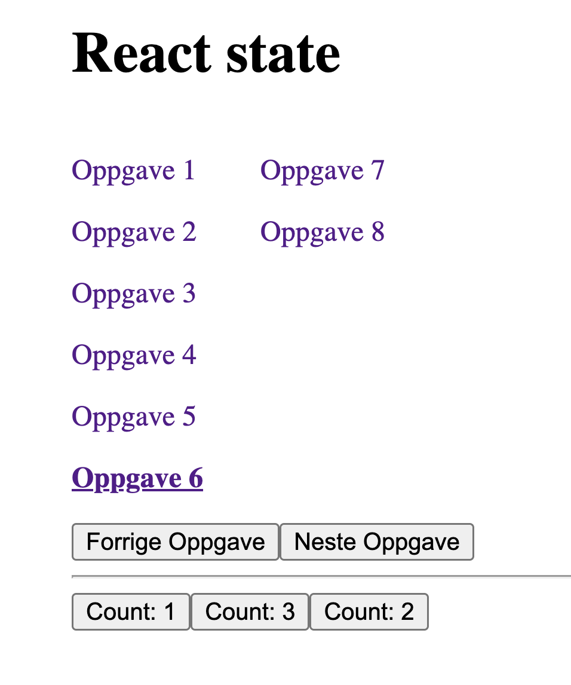

# React state



Eksempler for å lære bort state i React. Du finner eksemplene i `src/oppgaver`.

# Setup

Node version (see .nvmrc):

```
nvm use
```

Install

```
npm install
```

# App run

Run client and server: (port 3000 and 8000)

```
npm run dev
```
